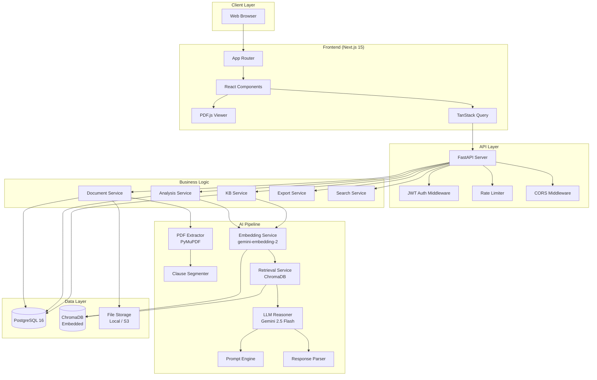
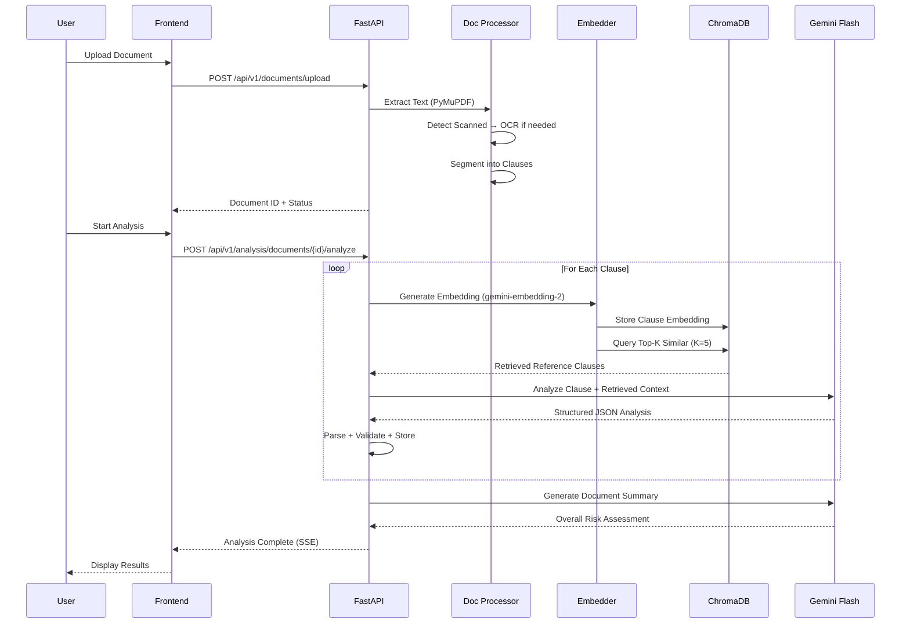

# Architecture Documentation

## System Architecture

## RAG Pipeline Flow

## Data Flow

1. **Upload**: User uploads PDF → stored on disk → metadata in PostgreSQL
2. **Extract**: PyMuPDF extracts text, detects structure (headings, lists, numbering)
3. **Segment**: Rule-based segmenter splits into logical legal clauses
4. **Embed**: Each clause → gemini-embedding-2 → vector stored in ChromaDB
5. **Retrieve**: For each clause, query ChromaDB for Top-5 similar reference clauses
6. **Analyze**: Gemini 2.5 Flash receives original + retrieved context → structured JSON
7. **Store**: Analysis results persisted in PostgreSQL
8. **Display**: Frontend renders clause cards, risk badges, PDF highlights

## Security Architecture

- **Authentication**: JWT access tokens (30 min) + refresh tokens (7 days)
- **Authorization**: User-scoped data access (users see only their documents)
- **Input Validation**: Pydantic v2 schemas on all inputs
- **File Validation**: Type checking, size limits, filename sanitization
- **Rate Limiting**: Per-IP throttling via SlowAPI
- **CORS**: Whitelisted origins only
- **Prompt Injection Prevention**: Delimited contexts, input validation, system-level instructions to ignore adversarial content
