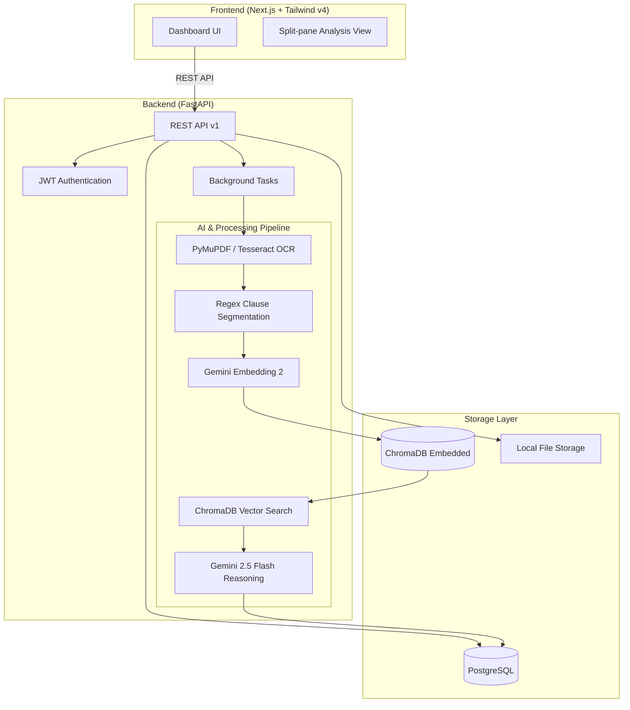

# Architecture Overview

This document outlines the system architecture for the Legal & Policy Document Simplifier.

## High-Level System Architecture

## Data Flow (Document Upload)

1. **Client**: Uploads a PDF to `/api/v1/documents/upload`.
2. **API**: Saves file to Local Storage and creates a PostgreSQL `Document` record with status `uploaded`. Returns HTTP 201 to client instantly.
3. **API**: Spawns a FastAPI `BackgroundTask`.
4. **Task (Extract)**: PyMuPDF extracts text. If it detects an image-only PDF, it falls back to `pytesseract`.
5. **Task (Segment)**: Regex rules break the raw text into distinct clauses (e.g. "1.1", "Article II"). Saved to DB.
6. **Task (Embed)**: `gemini-embedding-2` converts the text of each clause into a 768-dimensional vector.
7. **Task (Retrieve)**: The vector is used to query the embedded ChromaDB for the Top-5 most similar standard reference clauses.
8. **Task (Reason)**: The target clause and the 5 reference clauses are injected into a strict prompt. `gemini-2.5-flash` evaluates the risk, structured via `response_schema` into a Pydantic model.
9. **Task (Aggregate)**: The LLM generates a document-wide executive summary. Status set to `completed`.
10. **Client**: The frontend polling `GET /documents/{id}` detects the `completed` status and fetches the `/analysis/` endpoints to render the dashboard.
